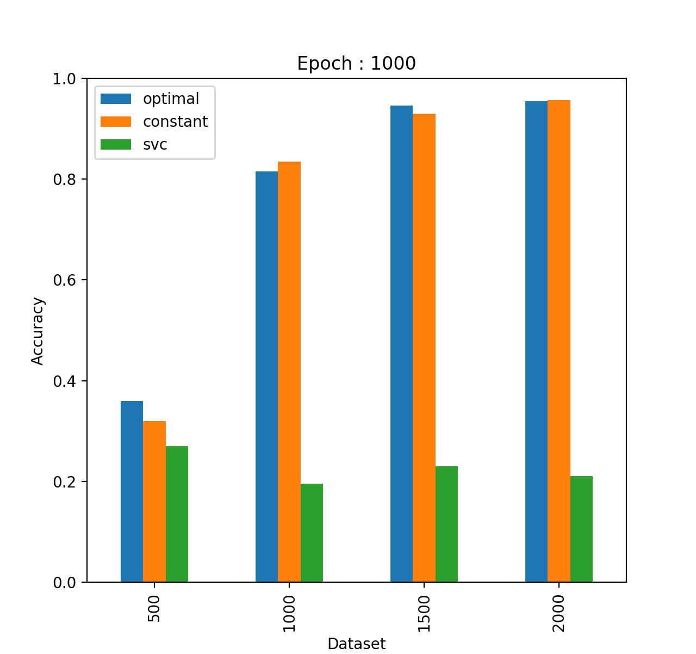

# News Categorization
Linear Support Vector Machine with Stochastic Gradient Decent Training for News Categorization.

## Features
**Dataset :** BBC News.

**Feature Representation:** Word Vectors (Word2Vec).

**Word2Vec Model :** : Skip Gram.

**Negative Sampling:** Yes.

## Download and Install
1. Clone the repository as it is.
2. Run `python classify.py` to start training.

## Result Accuracy

     

     
    
